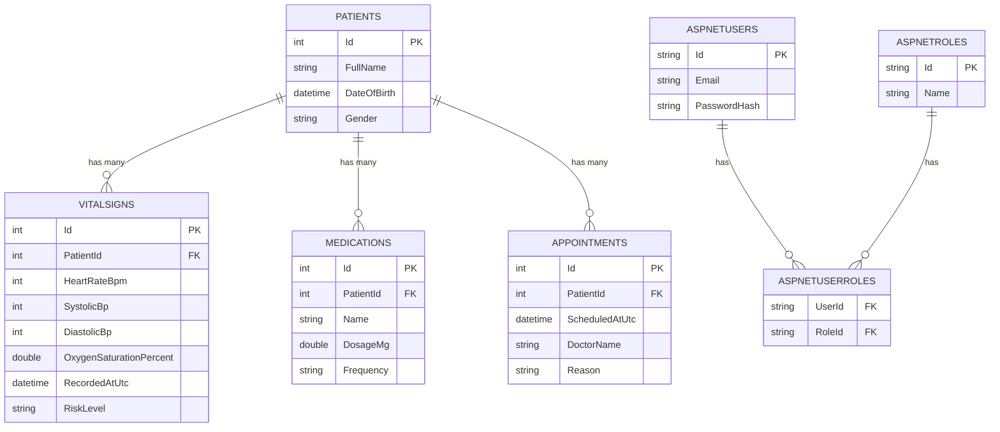

# Cardiac Monitoring System — Entity Relationship Diagram

Rendered automatically by GitHub from Mermaid syntax below — no external
diagramming tool required, and stays version-controlled alongside the schema
it documents.

## Normalization Confirmation (3NF)

- **1NF** — every column holds a single atomic value (no comma-separated lists;
  e.g. `Medication.Frequency` is a single descriptive string, not a multi-value field).
- **2NF** — no composite primary keys in the domain tables, so partial-key
  dependency doesn't apply; every non-key column depends on the whole key (`Id`).
- **3NF** — no non-key column depends on another non-key column. `Patient.FullName`
  is stored only on `Patients`, never duplicated onto `VitalSigns`/`Medications`/
  `Appointments` even though those tables reference a patient — each fact lives in
  exactly one place.

## Relationships

- `Patient` → `VitalSign` : one-to-many, cascade delete
- `Patient` → `Medication` : one-to-many, cascade delete
- `Patient` → `Appointment` : one-to-many, cascade delete
- `AspNetUser` → `AspNetRole` : many-to-many via `AspNetUserRoles` (standard
  ASP.NET Core Identity schema)
